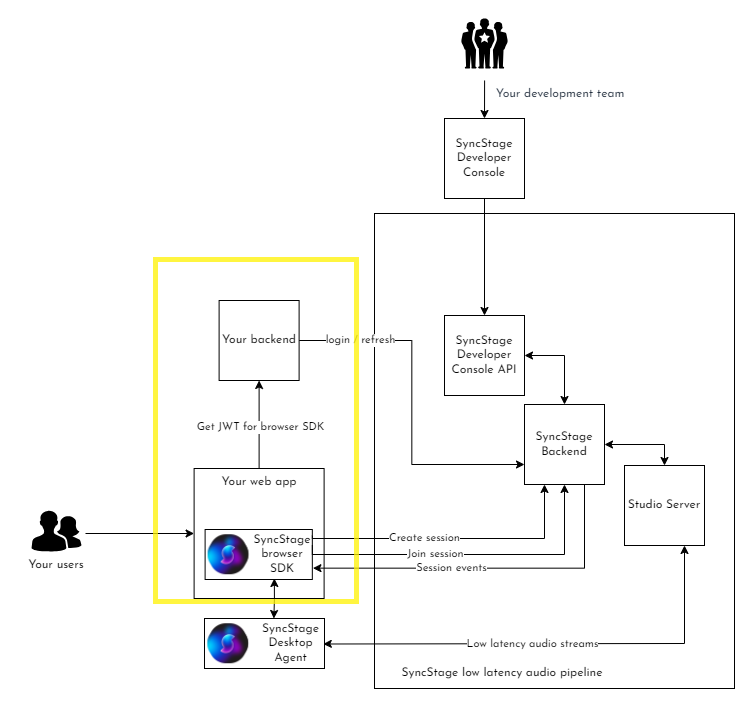

# SyncStage Web Test Application

This repository provides code to deploy a test environment for SyncStage Web SDK. It allows to run the services using docker-compose or AWS Amplify.

The exemplary project repository covers yellow-boxed part of the architecture. For more information please visit [SyncStage Docs](https://docs.sync-stage.com/web/overview).



## Running the application with Docker Compose - fast track

1. Create `.env` file within `web-application` directory and fill it with following variables:

```
REACT_APP_BACKEND_BASE_PATH=http://localhost:3000/api
```

2. Ensure Docker and docker-compose are installed on your machine.
3. Copy the SyncStageSecret.json file into the `backend/src` path.
4. Open a terminal and navigate to the root directory of the repository.
5. Run the following command: `docker-compose up`
6. The application will start and you can access it in your browser at `http://localhost:3001` (it might take some time to load, because it runs in development mode)

### Swagger

You can view the server API Swagger definition under: http://localhost:3000/api-docs 

### Important Notes

Please note that the backend code provided in this application is exemplary and should not be used as-is in a production environment.

* The SyncStageSecret.json file contains sensitive information and should be handled securely.
* The dummy user-db.json file stores user information in plaintext and should not be used in a production environment.
* The server also contains a dummy implementation of generating and validating JWT tokens. This is for testing purposes only and should not be used in a production environment.

## Running application using AWS Amplify

Amplify implementation solves problem of securing SyncStageSecret.json and provides with user pool using AWS services. 

### Prerequisities 

1. Developer must have an access to the AWS console.
2. Amplify CLI tool installed and provisioned with AWS account

### Deployment

1. Navigate to `web-application` directory
2. Make sure `.env` is removed or `REACT_APP_BACKEND_BASE_PATH` is removed from the .env file
3. Deploy amplify backend services running `amplify push`. You will be asked to provide SyncStageSecret.
4. In another terminal run yarn start. That will trigger deployment development server for the react.js frontend application locally on the machine.
5. To run production build and deploy the frontend on AWS Amplify run `amplify publish`


The exemplary application does not include views for user sign up. In order to create user in AWS Cognito user pool you need to run CLI commands with relevant `<values>`:
```
aws cognito-idp admin-create-user --user-pool-id <value> --username <value> --temporary-password <value>
aws cognito-idp admin-set-user-password --user-pool-id <value> --username <value> --password <value> --permanent
```

